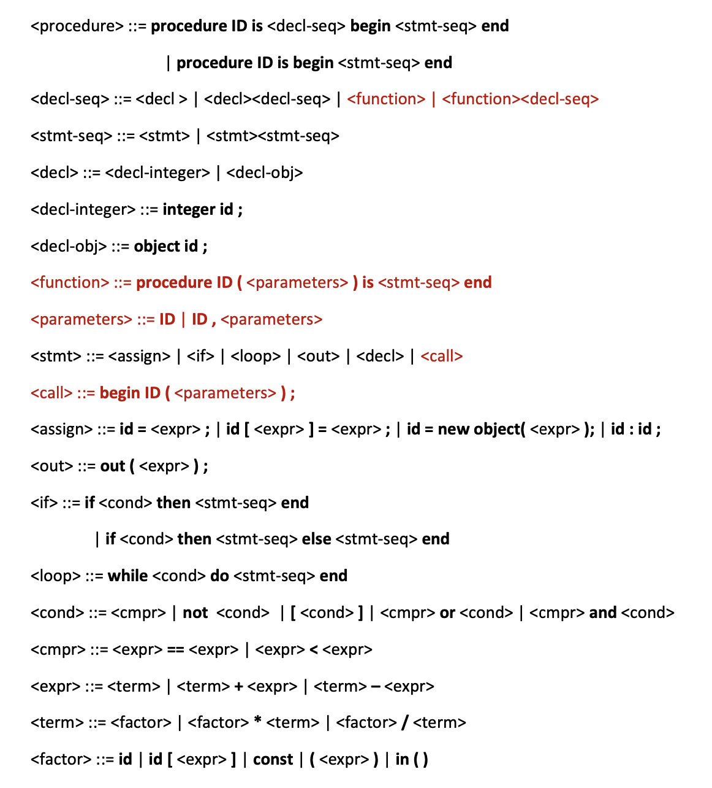

# Core Interpreter

## Organization

- **Instructor**: Dr. Timothy Carpenter
- **Course**: CSE 3341 - Principles of Programming Languages, The Ohio State University, Spring 2024

## Overview

This Core Interpreter is designed for the CSE 3341 course to parse and execute programs written in the Core language, a simple programming language designed for educational purposes. The interpreter incorporates advanced features like function calls, recursion, and garbage collection using reference counting.

## File Descriptions

- **Main.java**: Initializes the interpreter and starts the program execution.
- **Parser.java**: Contains logic for parsing the Core language using a recursive descent approach.
- **Procedure.java**: Manages the execution of procedures including initiating and handling procedure calls.
- **SymbolTable.java**: Implements a symbol table to manage scope, track variable declarations, and support semantic checks during parsing and execution. It also aids in simulating garbage collection by managing reference counts.
- **Other .java files**: Each corresponds to non-terminal elements of the Core grammar, handling specific syntactic structures.

## Features

- **Recursive Descent Parsing**: Employs recursive descent parsing for syntax analysis.
- **Error Handling**: Utilizes a symbol table implemented as a stack of stacks (stack frames) to facilitate scope management and error checking. This structure is crucial for supporting nested function calls and ensuring correct variable scoping and lifetime.
- **Garbage Collection**: Implements reference counting for garbage management. Variables are reference counted, and garbage collection is simulated by removing variables with zero counts from the symbol table.
- **Function Calls**: Supports function calls, including recursive function calls. Modifications to the symbol table (use of stack frames) enable effective function scope management.

## Design and Implementation

The interpreter uses a class-based structure where each class represents a non-terminal in the Core language's grammar. The Parser class orchestrates these classes to build a parse tree and subsequently execute the program based on this tree:

- **Parse Tree Representation**: Each node in the tree corresponds to a grammar rule implemented as a Java class. These nodes are recursively connected to represent the program's syntactic structure.
- **Symbol Table**: The symbol table for parsing checks for declaration errors and scope issues, while the execution symbol table tracks runtime values and supports garbage collection.

## BNF Grammar

The Core language's grammar is defined using Backus-Naur Form (BNF) in the following format:


## Example Programs

```plaintext
procedure test is
    procedure add(a, b) is
        integer x;
        x = a[0] + b[0];
        out(x);
    end

    object x;
    object y;

    begin
        x = new object(1);
        y = new object(1);
        x[0] = 1;
        y[0] = 2;
        begin add(x, y);
        out(x[0]);
        out(y[0]);
    end
end
```
